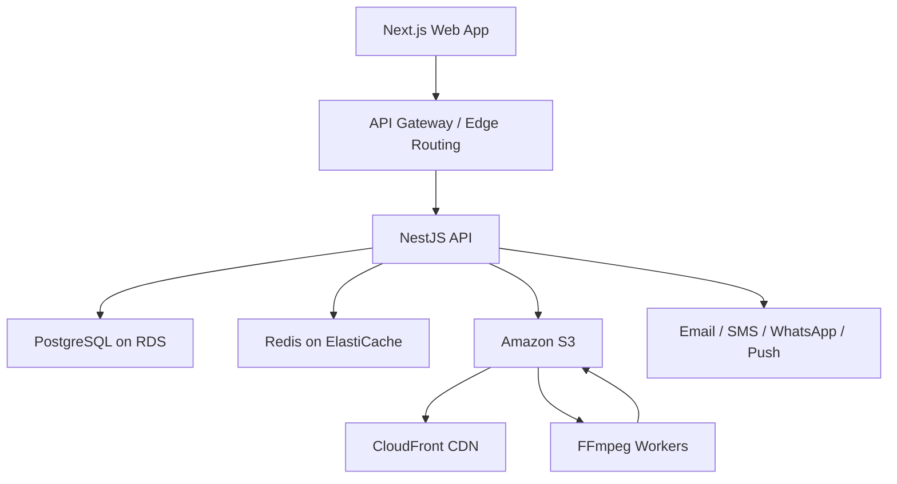

# Production Architecture

## Web

- Next.js
- TypeScript
- TailwindCSS
- ShadCN-style primitives
- React Query

## API

- NestJS modular monolith for the first production release.
- JWT access tokens and refresh tokens.
- Swagger documentation at `/docs`.
- Later extraction candidates: media processing, notifications, search, payments.

## Data

Initial PostgreSQL tables:

- `users`
- `landlord_profiles`
- `properties`
- `property_media`
- `amenities`
- `favorites`
- `messages`
- `visits`
- `reviews`
- `subscriptions`
- `payments`

## Media Flow

1. Landlord selects images or videos.
2. API returns a presigned S3 upload URL.
3. Browser uploads directly to S3.
4. API creates media records.
5. Worker generates thumbnails and video renditions.
6. CloudFront serves optimized assets.

## Search

- Start with PostgreSQL full text search and indexed filters.
- Add Elasticsearch/OpenSearch only after search volume or ranking requirements justify it.

## Multi-Business Platform

Shared modules should stay reusable for future grocery, farm produce, pharmacy, and local delivery businesses:

- Auth
- Users
- Payments
- Notifications
- Media
- Admin
- Analytics
